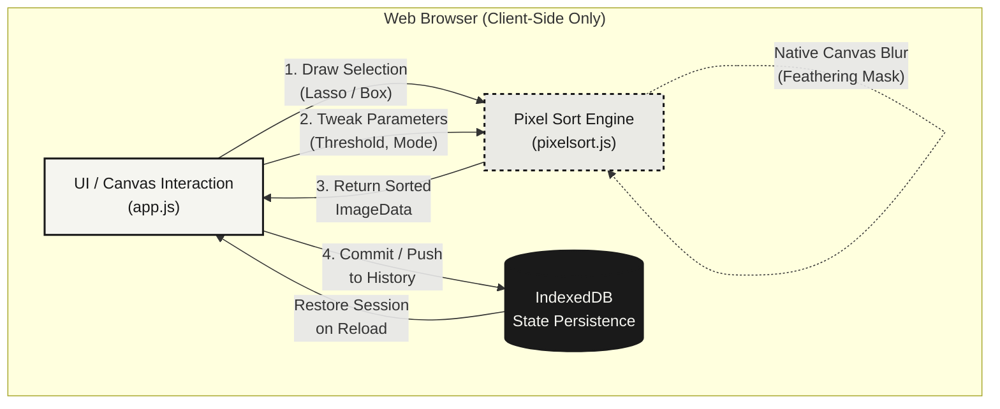

# Drift.
  
Interactive regional pixel sorting and glitch art playground. Fast, client-side, and persistent.

Everything runs in your browser. Nothing is uploaded.

## Features

| Feature | Description |
|---------|-------------|
| **7 Sort Modes** | Brightness, Hue, Saturation, Red, Green, Blue, Gamma |
| **Hot-Apply** | Sorting updates live as you drag sliders or change modes — no "Apply" button needed |
| **Region Selection** | Click-drag on the canvas (even from outside) or click **Select All** for full image |
| **Iteration History** | ← Back / Forward → through every sort step, with a Flatten button to collapse |
| **Basic Filters** | Brightness, Contrast, Blur, Sharpen, Invert, Grayscale — applied via Canvas 2D |
| **Storage Management** | Tracks history memory usage, warns at 50 MB, offers Clear History and ZIP export |
| **Export** | Save the result as PNG, or export all history steps as a ZIP |
| **State Persistence** | Auto-saves to IndexedDB — reload the page and pick up where you left off |
| **Keyboard Shortcuts** | `U` upload, `E` export, `Ctrl+Z` back, `Ctrl+Y` forward, `Enter` commit, `F` apply filter |

## Usage

1. **Development**: Run `npm run dev` to start the local server.
2. **Production**: Run `npm run build` to generate the `dist` folder.
3. **App**:
   - Click **Upload** (or drag-drop) to load an image.
   - Draw a selection rectangle on the canvas or click **Select All**.
   - Adjust sort mode, direction, thresholds, and noise — the sort previews live.
   - Press **Commit** (or `Enter`) to save the result.
   - Use **← Back** / **Forward →** to browse iterations.
   - Click **Export** to download the final image.

## Architecture & Workflow

## Tech Stack

- **HTML / CSS / Vanilla JS** — No heavy frameworks
- **Vite** — Build tool and dev server
- **Canvas 2D API** — Pixel manipulation, masks, and CSS filters
- **IndexedDB** — Client-side state persistence
- **JSZip** — Batch history export as ZIP

## Credits & Inspiration

This project was inspired by several excellent resources on pixel sorting:

- **Acerola's YouTube Video**: [Pixel Sorting: The most overused glitch effect?](https://www.youtube.com/watch?v=HMmmBDRy-jE) 
- **Satyarth's Implementation**: [pixelsort (GitHub)](https://github.com/satyarth/pixelsort) 
- **Satyarth's Deep Dive**: [Pixel Sorting Article](https://satyarth.me/articles/pixel-sorting/).

## License

MIT

